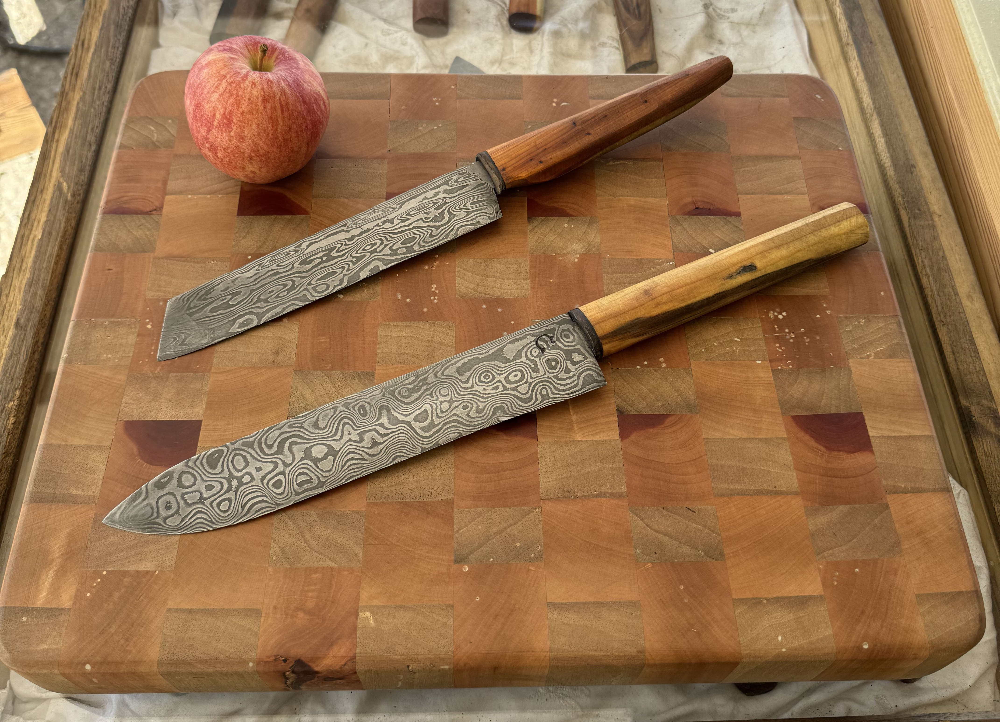
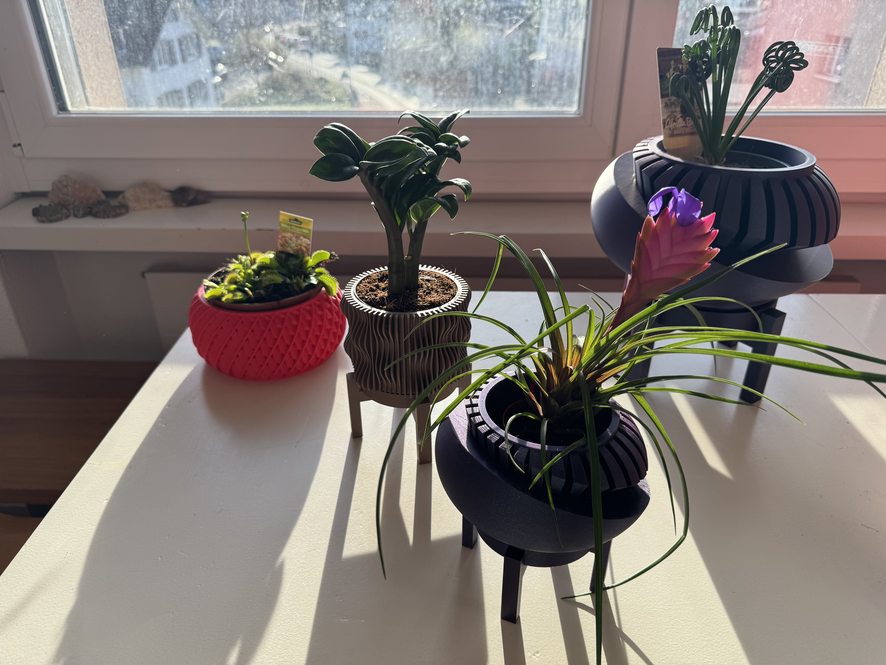

<!-- invert -->
# ChatGpt above and beyond 

## Ai tooling in a Devs workday

---

## About me

### Raphael Kuster

**Software Dev for ~10y** & a lot of random other stuff (festivals, woodworking & 3d print shop ...)

   <!-- fit -->

 **@rfKust**      **BigHoss**      **www.kuster.live**<!-- fit -->

---

# dotnet Usergroup Rheintal

Talk about Ml and Ai on 6. June

- Introduction to AI & ML
- How to use ChatGPT and how to use prompt engineering
- Use ChatGPT with your data (RAG)
- How to create a ChatGPT Plugin
- A overview of Azure AI Services
- ML.NET to train and deploy your custom model

<!-- _footer: "https://rheintal-dotnet.com/"-->
---

# Big-Agi

 Better gpt ui and cheaper use

[https://big-agi.com/](https://big-agi.com/)

<!--
https://platform.openai.com/

https://github.com/enricoros/big-agi

https://big-agi.com/

query:
 how would you create a marketing campaign for a club that tries to support and improve digitalization in its region
-->

<!-- _footer: "Big Agi" -->

---

# Agent Gpt

can run autonomous agents

## hosted

[https://agentgpt.reworkd.ai](https://agentgpt.reworkd.ai)

## self hosted

[https://github.com/reworkd/AgentGPT](https://github.com/reworkd/AgentGPT)

<!-- 
query:
Create a typescript scraper using cheerio to scrape this news page(https://digitaleinitiativen.at/geschichten/) and give me a json with all the headlines and descriptions of the entries
    -->

<!-- _footer: "Agent Gpt" -->

---

# Dev Tools

## Jetbrains Ai Assistant

## Github Copilot

## Cursor.sh

<!-- 
query
can you add the fields createdOn (text) and createdAt (timestamp)
-->

---

# Demo

---

## Thanks for your attention

The code is on github

[https://github.com/kuster-live/centralizedLogging-Seq](https://github.com/kuster-live/centralizedLogging-Seq)

<!-- _footer: "Backgroundimage by coolvector on Freepik" -->
<!-- link to background image https://www.freepik.com/free-vector/gradient-hexagonal-background_13955213.htm#query=svg%20background&position=3&from_view=keyword&track=ais&uuid=cd1420f3-a9b1-466b-80cd-7712f43308a7 -->
